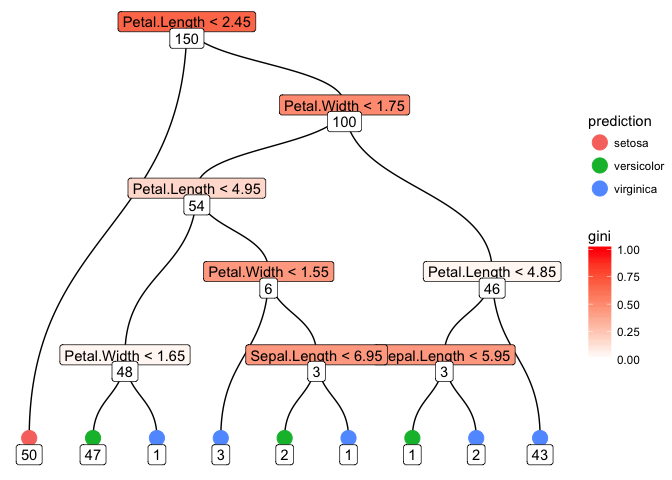

<!-- README.md is generated from README.Rmd. Please edit that file -->
tidytree
========

The goal of tidytree is to provide an understandable (but slow) implementation of a Decision Tree classifier.

Installation
------------

You can install tidytree from github with:

``` r
# install.packages("devtools")
devtools::install_github("datascienceworkshops/tidytree")
```

Example
-------

### Building a model

``` r
library(tidytree)
model <- tidytree(Species ~ ., iris)
model
#> tidytree model with 17 nodes
#> 
#> (Petal.Length < 2.45)
#>   |-TRUE => setosa
#>   |-FALSE (Petal.Width < 1.75)
#>     |-TRUE (Petal.Length < 4.95)
#>       |-TRUE (Petal.Width < 1.65)
#>         |-TRUE => versicolor
#>         |-FALSE => virginica
#>       |-FALSE (Petal.Width < 1.55)
#>         |-TRUE => virginica
#>         |-FALSE (Sepal.Length < 6.95)
#>           |-TRUE => versicolor
#>           |-FALSE => virginica
#>     |-FALSE (Petal.Length < 4.85)
#>       |-TRUE (Sepal.Length < 5.95)
#>         |-TRUE => versicolor
#>         |-FALSE => virginica
#>       |-FALSE => virginica
```

### Plotting a model

``` r
plot(model)
```



### Classifying new data points

``` r
predict(model, iris[c(1, 51, 101), ])
#> [1] setosa     versicolor virginica 
#> Levels: setosa versicolor virginica
```
